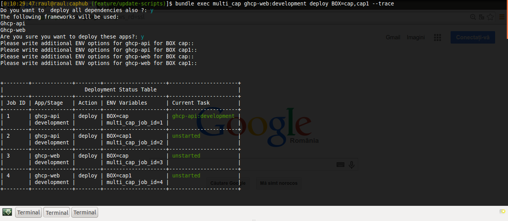

capistrano_multiconfig_parallel
==================

[](http://badge.fury.io/rb/capistrano_multiconfig_parallel)
[](https://github.com/bogdanRada/capistrano_multiconfig_parallel)
[](https://github.com/bogdanRada/capistrano_multiconfig_parallel)
[](https://github.com/bogdanRada/capistrano_multiconfig_parallel)

DEMO
--------

[](#features)

Description
--------
CapistranoMulticonfigParallel is a simple ruby implementation that allows you to run multiple tasks in parallel for multiple applications and uses websockets for inter-process communication and has a interactive menu

IMPORTANT!  The whole reason for this gem was for using [Caphub][caphub]  in a more easy way and allowing you to run tasks in parallel for multiple aplications . 
However this can be used for normal applications also, if you want for example to deploy your app to multiple sandboxes on development environment
or even deploy in parallel to multiple stages.

CAUTION!! PLEASE READ CAREFULLY!! Capistrano is not thread-safe. However in order to work around this problem, each of the task is executing inside a thread that spawns a new process in order to run capistrano tasks
The thread monitors the process. This works well, however if the tasks you are executing is working with files, you might get into deadlocks because multiple proceses try to access same resource.
Instead of using files , please consider using StringIO instead. 

[caphub]: https://github.com/railsware/caphub

Requirements
--------
1.  [Ruby 1.9.x or Ruby 2.x.x][ruby]
2. [ActiveSuport >= 4.2.0][activesupport]
3. [celluloid-pmap >= 0.2.0][celluloid_pmap]
5. [composable_state_machine >= 1.0.2][composable_state_machine]
6. [terminal-table >= 1.4.5][terminal_table]
7. [colorize] [colorize]
8. [eventmachine >= 1.0.7] [eventmachine]
9. [right_popen >= 1.1.3] [right_popen]
10. [capistrano-multiconfig >= 3.0.8] [capistrano-multiconfig]
11. [capistrano >= 3.0] [capistrano]
12. [configliere >= 0.4] [configliere]
13.  [inquirer >= 0.2] [inquirer]
14.  [devnull >= 0.1] [inquirer]

[ruby]: http://www.ruby-lang.org
[activesupport]:https://rubygems.org/gems/activesupport
[capistrano_multiconfig_parallel]:https://github.com/bogdanRada/capistrano_multiconfig_parallel
[celluloid_pmap]:https://github.com/jwo/celluloid-pmap
[composable_state_machine]: https://github.com/swoop-inc/composable_state_machine
[terminal_table]: https://github.com/tj/terminal-table
[formatador]: https://github.com/geemus/formatador
[colorize]: https://github.com/fazibear/colorize
[eventmachine]: https://github.com/eventmachine/eventmachine
[right_popen]: https://github.com/rightscale/right_popen
[capistrano-multiconfig]: https://github.com/railsware/capistrano-multiconfig
[capistrano]: https://github.com/capistrano/capistrano/
[configliere]: https://github.com/infochimps-platform/configliere
[inquirer]: https://github.com/arlimus/inquirer.rb
[devnull]: https://github.com/maraigue/devnull

Compatibility
--------

Rails >3.0 only. MRI 1.9.x, 2.x

Ruby 1.8 is not officially supported. We will accept further compatibilty pull-requests but no upcoming versions will be tested against it.

Rubinius and Jruby  support temporarily dropped due to Rails 4 incompatibility.


Installation Instructions
--------

Add the following to your Gemfile:
  
```ruby
  gem "capistrano_multiconfig_parallel"
```


Add the following to your Capfile after requiring **capistrano** and **capistrano-multiconfig**
  
```ruby
  require 'capistrano_multiconfig_parallel'
```

Please read  [Release Details][release-details] if you are upgrading. We break backward compatibility between large ticks but you can expect it to be specified at release notes.
[release-details]: https://github.com/bogdanRada/capistrano_multiconfig_parallel/releases

Default Configuration:
--------

```yaml
---
multi_debug: true
multi_secvential: false
websocket_server:
  enable_debug: false
  
development_stages: 
  - development
  - webdev

syncronize_confirmation: true
apply_stage_confirmation:
  - production  
task_confirmation_active: false  
task_confirmations: 
  - deploy:symlink:release

track_dependencies: false
application_dependencies: []
---
```

 Available command line  options when executing a command
--------

* --multi-debug
  * if option is present and has value TRUE , will enable debugging of workers

* --multi-secvential
  * If parallel executing does not work for you, you can use this option so that each process is executed normally and ouputted to the screen.
  However this means that all other tasks will have to wait for each other to finish before starting 

* --websocket_server.enable_debug 
  * if option is present and has value TRUE, will enable debugging of websocket communication between the workers

* --development_stages
  * if option is present and has value an ARRAY of STRINGS, each of them will be used as a development stage

* --syncronize_confirmation
  * if option is present and has value TRUE, all workers will be synchronized to wait for same task from the ***task_confirmations** Array before they execute it 

* --apply_stage_confirmation
  * If option is present and has value an ARRAY of STRING, each string should be the name of a stage. 
    The confirmations will only be applied if the workers are executing tasks to one of that stage.

* --task_confirmation_active
  * if option is present and has value TRUE, will enable user confirmation dialogs before executing each task from option  **--task_confirmations**

* --task_confirmations:
  * if option is present and has value an ARRAY of Strings, and --task_confirmation_active is TRUE , then will require a confirmation from user before executing the task. 
    This will syncronize all workers to wait before executing that task, then a confirmation will be displayed, and when user will confirm , all workers will resume their operation.

* --track_dependencies
  * This should be useed only for Caphub-like applications , in order to deploy dependencies of an application in parallel.
     This is used only in combination with option **--application_dependencies** which is described 
     at section **[2.) Multiple applications](#multiple_apps)**

Usage Instructions
========

In order to override default configurations, you can either specify them at runtime using command-line , or you can 
create a file in location **config/multi_cap.yml** . This settings will be overriden by command line arguments( if any)

## 1) Single Apps ( normal Rails or rack applications) 
    
CapistranoMulticonfigParallel recognizes only "development" and "webdev" as stages for development
if you use other stages for development, you need to configure it like this

```yaml
---
development_stages:
  - development
  - webdev
  - something_custom
----
```

### 1.1) Deploying the application  to multiple sandboxes ( works only with development environments)

```shell
# <box_name>     - the name of a sandbox
#<development_stage> - the name of one of the stages you previously configured
#<task_name> - the capistrano task that you want to execute ( example: 'deploy' )

bundle exec multi_cap  <development_stage> <task_name>   BOX=<box_name>,<box_name> 

```

If a branch is specified using **BRANCH=name** it will deploy same branch to all sandboxes
The branch environment variable is then passed to the capistrano task

Also the script will ask if there are any other environment variables that user might want to pass to each of the sandboxes separately.

### 1.2) Deploying the application  to multiple stages  ( Using the customized command "deploy_multi_stages")
  

```shell

bundle exec multi_cap deploy_multi_stages  STAGES=development, staging, production
```
NOTE: IF you want to execute a different command on all stages, you can specify environment variable **ACTION=task_name** either when you specify the STAGES, or can be done 
individually for each task when prompted about additional ENV options

If a branch is specified using **BRANCH=name**  it will deploy same branch to all stages.The branch environment variable is then passed to the capistrano task

Also the script will ask if there are any other environment variables that user might want to pass to each of the stages separately.

If you use **capistrano-gitflow**, the workers will first deploy to all the other stages 
and only after staging is tagged , will trigger a new worker to start deploying to production


## 2.)  Multiple Apps ( like [Caphub][caphub]  ) 


Configuration for this types of application is more complicated

```yaml
---
track_dependencies: true
application_dependencies:
    - app: foo'
      priority: 1
      dependencies: []
    - app: bar
      priority: 1
      dependencies: 
        - foo
    - app: foo2
      priority: 1
      dependencies: 
        - foo
        - bar
---
```

The "development_stages" options is used so that the gem can know if sandboxes are allowed for those environments.


If you want to deploy an application with dependencies you can use   the option "track_dependencies".
If that options has value "true" , it will ask the user before deploying a application if he needs the dependencies deployed too

The dependencies are being kept in the option "application_dependencies"
This is an array of hashes. Each hash has only the keys "app" ( app name), "priority" and "dependencies" ( an array of app names that this app is dependent to)

In this example, if we execute this command:

```ruby
bundle exec multi_cap foo2:development deploy 
```

Will ask user if he wants to deploy the apps "foo" and "bar" , since they appear in the dependencies list for the application "foo2"
 

### 1.2) Deploying multiple application  to multiple stages  ( Using the customized command "deploy_multi_stages")
  

```shell

bundle exec multi_cap deploy_multi_stages  STAGES=development, staging, production
```

NOTE: IF you want to execute a different command on all stages, you can specify environment variable **ACTION=task_name** either when you specify the STAGES, or can be done 
individually for each task when prompted about additional ENV options

If a branch is specified using **BRANCH=branch_name** it will deploy same branch to all stages.The branch environment variable is then passed to the capistrano task
If you want different branches , capistrano will ask for additional ENV options for each stage, and can be specified then for each stage

If you use **capistrano-gitflow**, the workers will first deploy to all the other stages 
and only after staging is tagged , will trigger a new worker to start deploying to production

Known Limitations
--------
- Currently it works only if Celluloid.cores >= 2

 Testing
--------

To test, do the following:

1. cd to the gem root.
2. bundle install
3. bundle exec rake

Contributions
--------

Please log all feedback/issues via [Github Issues][issues].  Thanks.

[issues]: http://github.com/bogdanRada/capistrano_multiconfig_parallel/issues

Contributing to capistrano_multiconfig_parallel
--------

* Check out the latest master to make sure the feature hasn't been implemented or the bug hasn't been fixed yet.
* Check out the issue tracker to make sure someone already hasn't requested it and/or contributed it.
* Fork the project.
* Start a feature/bugfix branch.
* Commit and push until you are happy with your contribution.
* Make sure to add tests for it. This is important so I don't break it in a future version unintentionally.
* Please try not to mess with the Rakefile, version, or history. If you want to have your own version, or is otherwise necessary, that is fine, but please isolate to its own commit so I can cherry-pick around it.
* You can read more details about contributing in the [Contributing][contributing] document

[contributing]: https://github.com/bogdanRada/capistrano_multiconfig_parallel/blob/master/CONTRIBUTING.md

== Copyright

Copyright (c) 2015 bogdanRada. See LICENSE.txt for
further details.
