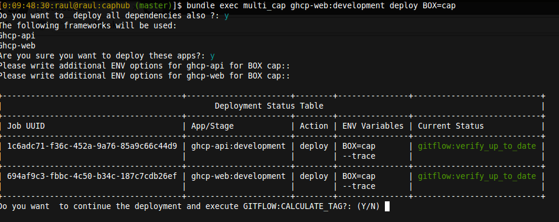

capistrano_multiconfig_parallel
===============================

[](http://badge.fury.io/rb/capistrano_multiconfig_parallel) [](https://github.com/bogdanRada/capistrano_multiconfig_parallel) [](https://github.com/bogdanRada/capistrano_multiconfig_parallel) [](https://github.com/bogdanRada/capistrano_multiconfig_parallel) [](https://gitter.im/bogdanRada/capistrano_multiconfig_parallel?utm_source=badge&utm_medium=badge&utm_campaign=pr-badge&utm_content=badge)

This README is for version 1.7.2 or lower. Please consider upgrading to latest version. Or at least try it out :)
-----------------------------------------------------------------------------------------------------------------

DEMO
----

[](#features)

Description
-----------

CapistranoMulticonfigParallel is a simple ruby implementation that allows you to run multiple tasks in parallel for multiple applications and uses websockets for inter-process communication and has a interactive menu

IMPORTANT! The whole reason for this gem was for using [Caphub](https://github.com/railsware/caphub) in a more easy way and allowing you to run tasks in parallel for multiple aplications . However this can be used for normal applications also, if you want for example to deploy your app to multiple sandboxes on development environment or even deploy in parallel to multiple stages.

CAUTION!! PLEASE READ CAREFULLY!! Capistrano is not thread-safe. However in order to work around this problem, each of the task is executing inside a thread that spawns a new process in order to run capistrano tasks The thread monitors the process. This works well, however if the tasks you are executing is working with files, you might get into deadlocks because multiple proceses try to access same resource. Instead of using files , please consider using StringIO instead.

NEW improvements in version 2.0.0.alpha

-	Code for handling capistrano requests was moved to a new gem [capistrano_sentinel](https://github.com/bogdanRada/capistrano_sentinel]

NEW Improvements in version 1.2.0
---------------------------------

-	support for Celluloid 0.17 was added

NEW Improvements in version 1.1.0
---------------------------------

-	a lot of refactoring and bug fixes
-	added posibility to run the deployments from a single directory and is described at section **[2.2) Deploying multiple applications from a central location](#22-deploying-multiple-applications-from-a-central-location)**

NEW Improvements in version 1.0.5
---------------------------------

-	added support for Capistrano version 2 (Capistrano 3 was already supported)
-	a lot of refactoring and bug fixes
-	removed BRANCH variable ( this needs to be passed when asked for additional env options for each job!!!) ( for Capistrano 2 should be **-S branch=branch_name**, for Capistrano 3 should be **BRANCH=branch_name**, or could be something else depending on your configuration).

Requirements
------------

1.	[ActiveSuport >= 4.2.0](https://rubygems.org/gems/activesupport)
2.	[celluloid-pmap >= 0.2.2](https://github.com/jwo/celluloid-pmap)
3.	[celluloid_pubsub >= 0.1.0](https://github.com/bogdanRada/celluloid_pubsub)
4.	[celluloid-websocket-client >= 0.0.1](https://github.com/jeremyd/celluloid-websocket-client)
5.	[composable_state_machine >= 1.0.2](https://github.com/swoop-inc/composable_state_machine)
6.	[terminal-table >= 1.5.2](https://github.com/tj/terminal-table)
7.	[colorize >= 0.7](https://github.com/fazibear/colorize)
8.	[eventmachine >= 1.0.3](https://github.com/eventmachine/eventmachine)
9.	[right_popen >= 1.1.3](https://github.com/rightscale/right_popen)
10.	[capistrano >= 2.0](https://github.com/capistrano/capistrano/)
11.	[configliere >= 0.4](https://github.com/infochimps-platform/configliere)
12.	[inquirer >= 0.2](https://github.com/arlimus/inquirer.rb)
13.	[devnull >= 0.1](https://github.com/arlimus/inquirer.rb)
14.	[rack >= 1.6](http://rack.github.io/)
15.	[rake >= 10.4](https://github.com/ruby/rake)

Compatibility
-------------

Rails >3.0 only. [MRI 1.9.x or 2.x](http://www.ruby-lang.org)

Ruby 1.8 is not officially supported. We will accept further compatibilty pull-requests but no upcoming versions will be tested against it.

Rubinius and Jruby support temporarily dropped due to Rails 4 incompatibility.

Installation Instructions
-------------------------

Add the following to your Gemfile after requiring **capistrano** and **capistrano-multiconfig**:

```ruby
  gem "capistrano_multiconfig_parallel"
```

Add the following to your Capfile after requiring **capistrano** and **capistrano-multiconfig**

```ruby
  require 'capistrano_multiconfig_parallel'
```

Please read [Release Details](https://github.com/bogdanRada/capistrano_multiconfig_parallel/releases) if you are upgrading. We break backward compatibility between large ticks but you can expect it to be specified at release notes.

Default Configuration:
----------------------

```yaml
---
multi_debug: true
multi_secvential: false
check_app_bundler_dependencies: false
websocket_server:
  enable_debug: false
  adapter: ''
  log_file_path: './log/multi_cap_websocket.log'
terminal:
  clear_screen: false  

development_stages:
  - development
  - webdev

apply_stage_confirmation:
  - production  
task_confirmations:
  - deploy:symlink:release

application_dependencies: []
---
```

Available command line options when executing a command
-------------------------------------------------------

-	--multi-debug

	-	if option is present and has value TRUE , will enable debugging of workers

-	--multi-secvential

	-	If parallel executing does not work for you, you can use this option so that each process is executed normally and ouputted to the screen. However this means that all other tasks will have to wait for each other to finish before starting

-	--check_app_bundler_dependencies

	-	if option is present and has value TRUE , will check the application bundler dependecies are satisfied before delegating the job to the actor that executes the capistrano action -

-	--websocket_server.enable_debug

	-	if option is present and has value TRUE, will enable debugging of websocket communication between the workers

-	--websocket_server.adapter

	-	Can be specified a different adapter for the websocket reactor class used for publish subscribe communication

-	--websocket_server.log_file_path

	-	Enables the logging of websocket communication into a different file -

-	--terminal.clear_screen

	-	Enables the clear screen to happen before the table status is displayed on screen

-	--config_dir

	-	The directory where the config file (multi_cap.yml) is located. The gem will try to detect if file exist in current directory from where the script is runnning

-	--log_dir

	-	The path where the log files will be created. By default it depends on the **config_dir**. It will create a **log** directory in the same directory as the configuration directory

-	--development_stages

	-	if option is present and has value an ARRAY of STRINGS, each of them will be used as a development stage

-	--apply_stage_confirmation

	-	If option is present and has value an ARRAY of STRING, each string should be the name of a stage. The confirmations will only be applied if the workers are executing tasks to one of that stage.

-	--task_confirmations:

	-	if option is present and has value an ARRAY of Strings (Task Names), then will require a confirmation from user before executing the task. This will syncronize all workers to wait before executing that task, then a confirmation will be displayed, and when user will confirm , all workers will resume their operation.

-	--application_dependencies

	-	This should be used only for Caphub-like applications , in order to deploy dependencies of an application in parallel and is described at section **[2.) Multiple applications](#2-multiple-apps--like-caphub-)**

Usage Instructions
==================

In order to override default configurations, you can either specify them at runtime using command-line , or you can create a file in location **config/multi_cap.yml** . This settings will be overriden by command line arguments( if any)

1) Single Apps ( normal Rails or rack applications)
---------------------------------------------------

CapistranoMulticonfigParallel recognizes only "development" and "webdev" as stages for development if you use other stages for development, you need to configure it like this

```yaml
---
development_stages:
  - development
  - webdev
  - something_custom
----
```

### 1.1) Deploying the application to multiple sandboxes ( works only with development environments)

```shell
# <box_name>     - the name of a sandbox
#<development_stage> - the name of one of the stages you previously configured
#<task_name> - the capistrano task that you want to execute ( example: 'deploy' )

bundle exec multi_cap  <development_stage> <task_name>   BOX=<box_name>,<box_name>  

```

For Capistrano 2 application, the jobs will receive **-S box=<box_name>,<box_name>**, although you will use **BOX** when running the command. This so that i can maintain compatibility between versions

The script will ask if there are any other environment variables that user might want to pass to each of the sandboxes separately.

### 2.1) Deploying the application to multiple stages ( Using the customized command "deploy_multi_stages")

```shell

bundle exec multi_cap deploy_multi_stages  STAGES=development, staging, production
```

NOTE: IF you want to execute a different command on all stages, you can specify environment variable **ACTION=task_name** either when you specify the STAGES, or can be done individually for each task when prompted about additional ENV options

The script will ask if there are any other environment variables that user might want to pass to each of the stages separately.

If you use **capistrano-gitflow**, the workers will first deploy to all the other stages and only after staging is tagged , will trigger a new worker to start deploying to production

2.) Multiple Apps ( like [Caphub](https://github.com/railsware/caphub) )
------------------------------------------------------------------------

Configuration for this types of application is more complicated

```yaml
---
application_dependencies:
    - app: foo'
      priority: 1
      dependencies: []
    - app: bar
      priority: 1
      dependencies:
        - foo
    - app: foo2
      priority: 1
      dependencies:
        - foo
        - bar
---
```

The "development_stages" options is used so that the gem can know if sandboxes are allowed for those environments.

The dependencies are being kept in the option "application_dependencies" This is an array of hashes. Each hash has only the keys "app" ( app name), "priority" and "dependencies" ( an array of app names that this app is dependent to)

In this example, if we execute this command:

```ruby
bundle exec multi_cap foo2:development deploy
```

Will ask user if he wants to deploy the apps "foo" and "bar" , since they appear in the dependencies list for the application "foo2"

### 2.1) Deploying multiple application to multiple stages ( Using the customized command "deploy_multi_stages")

```shell

bundle exec multi_cap deploy_multi_stages  STAGES=development, staging, production
```

Demo:

[](#features)

NOTE: IF you want to execute a different command on all stages, you can specify environment variable **ACTION=task_name** either when you specify the STAGES, or can be done individually for each task when prompted about additional ENV options

The script will ask for additional ENV options for each stage.

If you use **capistrano-gitflow**, the workers will first deploy to all the other stages and only after staging is tagged , will trigger a new worker to start deploying to production

### 2.2) [Deploying multiple applications from a central location](#deploy-from-central-location)

This works like described in section **[2) Multiple applications](#2-multiple-apps--like-caphub-)** ), but now the **application_dependencies** Array can also have a **path** key inside each item that should point to the DocumentRoot of that application, and the configuration now accepts two new arguments **config_dir** ( this should point to the directory where the file **multi_cap.yml** resides) and **log_dir**( this can be used if you want your logs created in different directory)

This will only work if all applications listed in the configuration file have the gem **capistrano_multiconfig_parallel** as part of their Gemfile.

Example of configuration: - create a directory anywhere (e.g.**mkdir /tmp/app**\) - create a Gemfile and add only this two lines:

```ruby
source 'http://rubygems.org'

gem 'capistrano_multiconfig_parallel'
```

or you could install it directly from command line:

```shell
gem install capistrano_multiconfig_parallel
```

Then create a file called **multi_cap.yml** in the root folder and create a configuration like this.

```yaml
   ---
   application_dependencies:
       - app: foo'
         priority: 1
         path: /some/path/to/foo
         dependencies: []
       - app: bar
         priority: 1
         path: /some/path/to/bar
         dependencies:
           - foo
       - app: foo2
         priority: 1
         path: /some/path/to/foo2
         dependencies:
           - foo
           - bar
   ---
```

and then you can run like you would normally do: (Apppend **bundle exec** to the below command only if you have a Gemfile)

```shell
multi_cap foo2:development deploy
```

Known Limitations
-----------------

-	Currently it works only if Celluloid.cores >= 2

Testing
-------

To test, do the following:

1.	cd to the gem root.
2.	bundle install
3.	bundle exec rake

Contributions
-------------

Please log all feedback/issues via [Github Issues](http://github.com/bogdanRada/capistrano_multiconfig_parallel/issues). Thanks.

Contributing to capistrano_multiconfig_parallel
-----------------------------------------------

-	Check out the latest master to make sure the feature hasn't been implemented or the bug hasn't been fixed yet.
-	Check out the issue tracker to make sure someone already hasn't requested it and/or contributed it.
-	Fork the project.
-	Start a feature/bugfix branch.
-	Commit and push until you are happy with your contribution.
-	Make sure to add tests for it. This is important so I don't break it in a future version unintentionally.
-	Please try not to mess with the Rakefile, version, or history. If you want to have your own version, or is otherwise necessary, that is fine, but please isolate to its own commit so I can cherry-pick around it.
-	You can read more details about contributing in the [Contributing](https://github.com/bogdanRada/capistrano_multiconfig_parallel/blob/master/CONTRIBUTING.md) document

== Copyright

Copyright (c) 2015 bogdanRada. See LICENSE.txt for further details.
